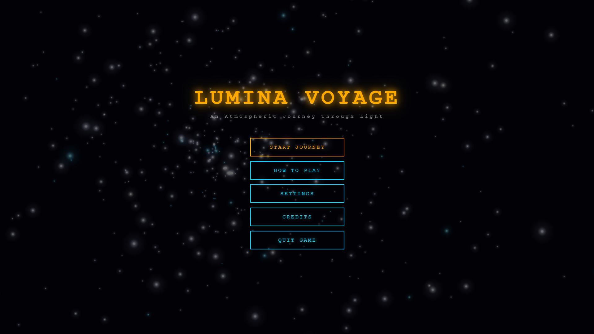
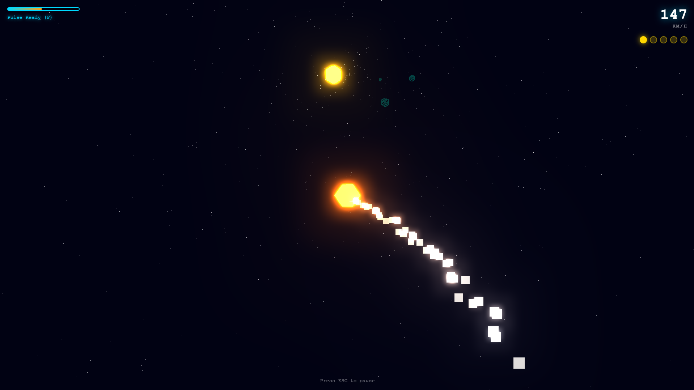
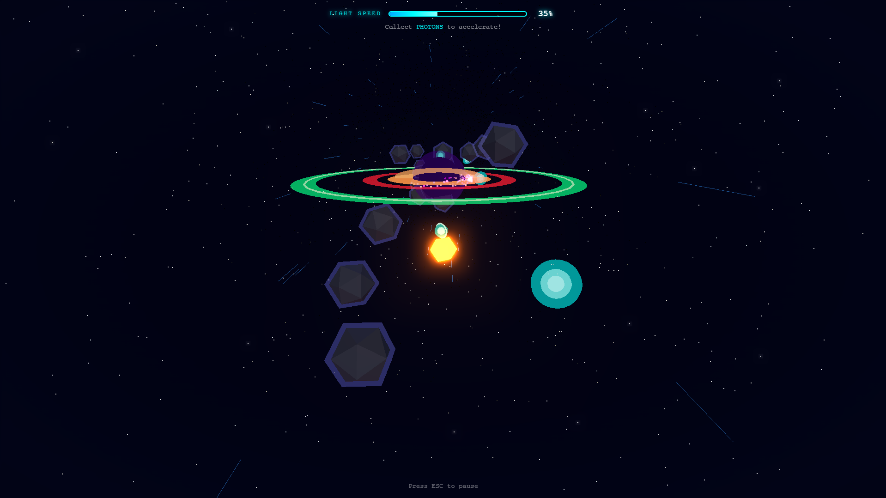
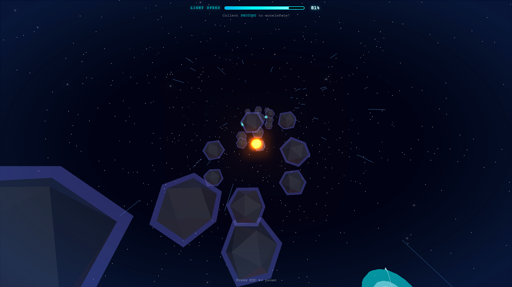

# Lumina Voyage

A 3D space exploration game built with Three.js featuring echolocation mechanics and procedural audio.

**[🎮 Play Live Demo](https://DaZorrus.github.io/lumina-voyage/)** | **[💻 Download Desktop Version (.exe)](https://github.com/DaZorrus/lumina-voyage/releases)**
<p align="center">
  
  <br>
  <em>Main Menu - Atmospheric starfield with dynamic glow</em>
</p>

## Overview

Lumina Voyage is an atmospheric 3D space game where players control a luminous orb exploring zero-gravity environments. The game features an echolocation pulse system for environmental discovery, procedural audio that builds with progression, and chapter-based gameplay with distinct mechanics. Built with vanilla Three.js using a modular architecture.

## Screenshots

<table>
  <tr>
    <td width="50%">
      
      <p align="center"><strong>Chapter 0: The Void</strong><br/>Echolocation tutorial with energy orb collection</p>
    </td>
    <td width="50%">
      
      <p align="center"><strong>Chapter 1: The Ascent</strong><br/>High-speed obstacle avoidance gameplay</p>
    </td>
  </tr>
  <tr>
    <td colspan="2">
      
      <p align="center"><strong>Light Speed Pursuit</strong><br/>3x3 grid movement with photon collection</p>
    </td>
  </tr>
</table>

## Features

**Core Mechanics**
- Echolocation pulse system for revealing hidden objects
- 6-DOF zero-gravity movement with physics simulation
- Progressive audio layers that unlock with gameplay events
- Dynamic camera effects (FOV shifts, screen shake)

**Visual Systems**
- Low-poly aesthetic with flat shading
- UnrealBloom post-processing for ethereal glow effects
- Particle trail system with color gradients
- Procedural starfield backgrounds

**Game Structure**
- Chapter 0: Tutorial level with energy orb collection
- Chapter 1: High-speed obstacle avoidance with 3x3 grid movement
- Save/load system for progress and settings
- Menu system with animated backgrounds

## Technical Stack

| Technology | Version | Purpose |
|-----------|---------|---------|
| Three.js | 0.160.0 | 3D rendering and scene management |
| Cannon-es | 0.20.0 | Physics simulation |
| Tone.js | 14.7.77 | Audio synthesis and procedural music |
| GSAP | 3.12.5 | Animation tweening |
| Vite | 5.0.11 | Build tool and dev server |

## Architecture

### Project Structure

```
src/
├── core/                      # Core engine systems
│   ├── Engine.js              # Main game loop, renderer, post-processing
│   ├── InputManager.js        # Keyboard/mouse input handling
│   └── SceneManager.js        # Chapter loading and transitions
│
├── systems/                   # Subsystems
│   ├── PhysicsSystem.js       # Cannon-es integration
│   ├── CameraSystem.js        # Camera follow and effects
│   ├── AudioSystem.js         # Tone.js procedural audio
│   └── ParticleSystem.js      # Particle effects and trails
│
├── chapters/                  # Level implementations
│   ├── BaseChapter.js         # Abstract base class
│   ├── Chapter0_TheVoid.js    # Tutorial level
│   └── Chapter1_TheAscent.js  # High-speed obstacle level
│
├── entities/                  # Game objects
│   ├── Player.js              # Player orb with pulse mechanic
│   ├── EnergyOrb.js           # Collectible objects
│   ├── Meteor.js              # Obstacles for Chapter 1
│   ├── Photon.js              # Speed boost pickups
│   ├── BlackHole.js           # Hazard entities
│   ├── ShadowComet.js         # Advanced hazards
│   ├── Portal.js              # Chapter exit portals
│   ├── PortalBeam.js          # Visual effect for portal spawn
│   └── PulseWave.js           # Echolocation wave sphere
│
├── ui/                        # User interface
│   ├── UIManager.js           # Screen management
│   ├── HUD.js                 # In-game heads-up display
│   ├── PauseMenu.js           # Pause screen
│   ├── MenuBackground.js      # Animated menu starfield
│   ├── ChapterComplete.js     # Victory screen
│   └── InstructionScreen.js   # Help screen
│
└── utils/                     # Utilities
    ├── Storage.js             # LocalStorage persistence
    └── ModelManager.js        # 3D model loading
```

### Design Patterns

**Entity System**: Base classes for game objects with lifecycle methods (update, destroy)

**System Architecture**: Decoupled systems for physics, audio, camera, particles

**Chapter Pattern**: BaseChapter provides common functionality, child classes implement specific gameplay

**Event-Driven Input**: InputManager centralizes keyboard/mouse handling

## Installation

### Prerequisites

- Node.js >= 16.0.0
- npm or yarn

### Setup

```bash
# Clone repository
git clone https://github.com/DaZorrus/lumina-voyage.git
cd lumina-voyage

# Install dependencies
npm install

# Start development server
npm run dev
```

Development server runs at `http://localhost:5173`

### Build

```bash
npm run build    # Production build to dist/
npm run preview  # Preview production build
```

## Controls

| Key | Action |
|-----|--------|
| W/S | Move forward/backward |
| A/D | Move left/right |
| Q/E | Move down/up |
| F | Echolocation pulse/Slingshot |
| Mouse | Camera Distance |
| H | Key Controls Hint |
| ESC | Pause menu |

## Gameplay

### Chapter 0: The Void
Tutorial level teaching core mechanics. Collect 5 energy orbs to spawn portal and complete chapter. Each orb collected increases speed and unlocks audio layer. Pulse mechanic reveals hidden orbs.

### Chapter 1: The Ascent
High-speed obstacle course with 3x3 grid movement system. Collect photons to increase speed toward light speed threshold. Avoid meteors, black holes, and shadow comets. Reach 100% speed to trigger final portal sequence.

### Progression System
- Collectibles increase player speed incrementally
- Audio layers unlock progressively (pad, bass, harmony, melody, rhythm)
- Camera FOV adjusts dynamically based on speed
- LocalStorage saves chapter completion and settings

## Game Systems

### Physics
Cannon-es provides rigid body physics with trigger detection. High linear/angular damping creates arcade-style zero-gravity movement.

### Audio
Tone.js generates procedural music. Base ambient pad plays continuously. Five additional layers activate based on gameplay events. Each chapter uses different musical scales.

### Camera
Third-person follow camera with smooth lerp. FOV dynamically adjusts from 50 to 75 degrees. Screen shake effect at high speeds.

### Post-Processing
EffectComposer with RenderPass and UnrealBloomPass. Bloom strength adjusts based on gameplay intensity.

## Configuration

Settings stored in LocalStorage:
- Master volume
- Music volume
- SFX volume
- Chapter unlock state
- Orb collection progress

## Development

Project uses ES6 modules. Vite handles bundling and hot module replacement. Three.js examples imported from `three/examples/jsm/`.

Main entry point: [src/main.js](src/main.js)

Core engine: [src/core/Engine.js](src/core/Engine.js)

### Desktop Version (Electron)

The game can be built as a standalone desktop application for Windows:

1. Install dependencies: `npm install`
2. Run in development mode: `npm run electron:dev`
3. Build for Windows (.exe): `npm run electron:build`

The executable will be generated in the `release/` directory.

## Documentation

Additional documentation in `doc/` directory:
- Game Design Document
- Technical Design Document

## License

MIT License

## Author

DaZorrus

---

Built with Three.js | 2025
